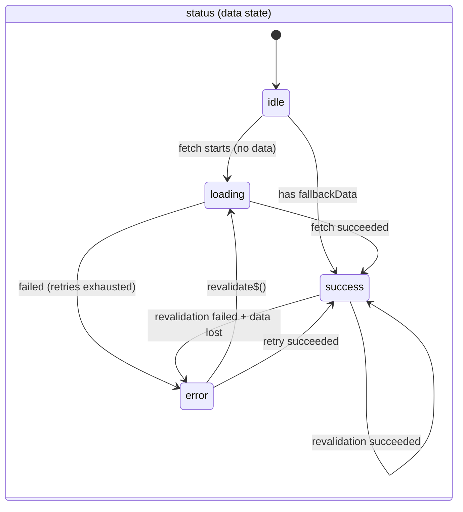
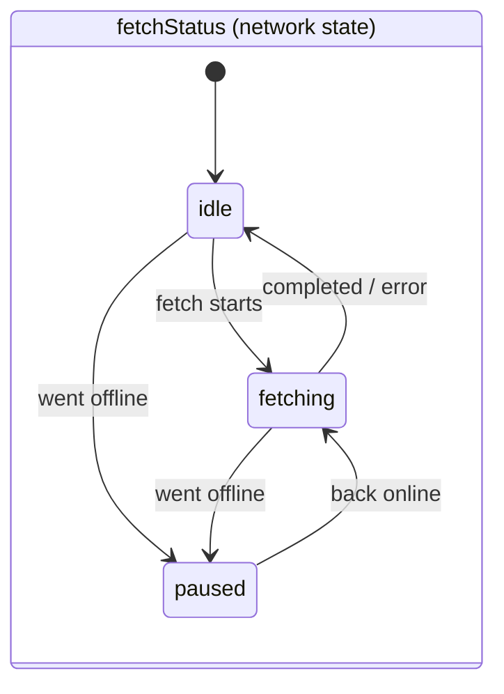
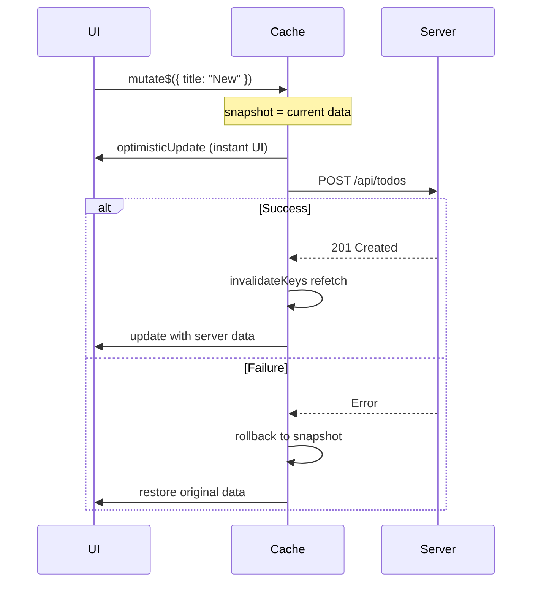
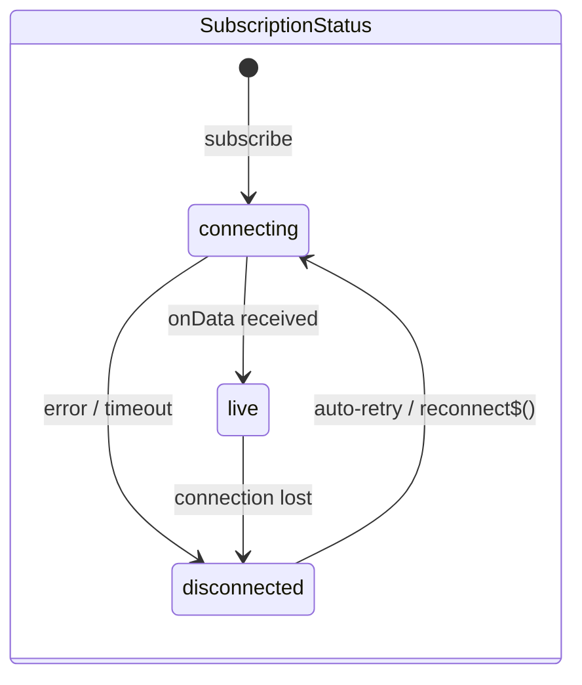
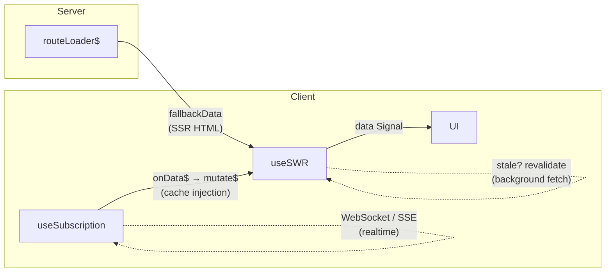

# qwik-swr

Stale-While-Revalidate data fetching library for [Qwik](https://qwik.dev).

## Features

- **Qwik-native** -- works with Signals, QRLs, and Resumability
- **Type-safe** -- full type inference from key to fetcher to response
- **Separated status model** -- `status` (data state) and `fetchStatus` (network state) never conflict
- **Freshness presets** -- 6 built-in presets from `volatile` to `static`
- **Request deduplication** -- concurrent calls with the same key share a single fetch
- **Auto revalidation** -- on focus, reconnect, or interval
- **Retry with backoff** -- configurable retry count and exponential backoff
- **Optimistic updates** -- `mutate$` with optional revalidation
- **SSR integration** -- works with Qwik City's `routeLoader$` via `fallbackData`
- **Global config** -- `SWRProvider` for app-wide defaults
- **Cache API** -- programmatic access to read, mutate, delete, prefetch, export/import
- **Cross-tab sync** -- cache changes propagate across browser tabs via BroadcastChannel
- **Notification batching** -- observer updates are batched per microtask/interval
- **Storage write batching** -- IndexedDB/localStorage writes are coalesced
- **Lazy hydration** -- on-demand cache loading for faster startup
- **Timer coordination** -- shared timers for refreshInterval polling
- **Memory-aware GC** -- maxEntries + deviceMemory-based adaptive limits
- **Real-time subscriptions** -- WebSocket/SSE with auto-reconnect and cross-tab dedup

## Install

```bash
npm install qwik-swr
```

Requires `@builder.io/qwik` >= 1.5.0 as a peer dependency.

## Quick Start

```tsx
import { component$, $ } from "@builder.io/qwik";
import { useSWR } from "qwik-swr";

export default component$(() => {
  const { data, error, isLoading } = useSWR<User[]>(
    "/api/users",
    $(async (ctx) => {
      const res = await fetch(ctx.rawKey, { signal: ctx.signal });
      if (!res.ok) throw new Error(`HTTP ${res.status}`);
      return res.json();
    }),
  );

  return (
    <div>
      {isLoading.value && <p>Loading...</p>}
      {error.value && <p>Error: {error.value.message}</p>}
      {data.value?.map((user) => (
        <p key={user.id}>{user.name}</p>
      ))}
    </div>
  );
});
```

## Initialization

Call `initSWR` once at app startup to configure storage, cross-tab sync, batching, and GC.

```tsx
import { initSWR } from "qwik-swr";
import { createIndexedDBStorage } from "qwik-swr/storage";

await initSWR({
  storage: createIndexedDBStorage(),
  sync: { enabled: true, channelName: "my-app" },
  batching: { notifyInterval: 0, storageFlushInterval: 50 },
  hydration: "lazy",
  gc: { maxEntries: 500, memoryAware: true },
});
```

If you skip `initSWR`, the library works with in-memory cache only -- no persistence, no cross-tab sync.

### `InitOptions`

| Field       | Type                | Default                                           | Description                                                        |
| ----------- | ------------------- | ------------------------------------------------- | ------------------------------------------------------------------ |
| `storage`   | `CacheStorage`      | --                                                | Storage backend (IndexedDB, localStorage, etc.)                    |
| `sync`      | `SyncConfig`        | `{ enabled: true }`                               | Cross-tab sync via BroadcastChannel                                |
| `batching`  | `BatchingConfig`    | `{ notifyInterval: 0, storageFlushInterval: 50 }` | Observer/storage write batching                                    |
| `hydration` | `"eager" \| "lazy"` | `"eager"`                                         | `eager` loads all entries at startup; `lazy` loads on first access |
| `gc`        | `GCConfig`          | `{ intervalMs: 60000, enabled: true }`            | Garbage collection config                                          |

### `SyncConfig`

| Field                   | Type      | Default      | Description                                                                            |
| ----------------------- | --------- | ------------ | -------------------------------------------------------------------------------------- |
| `enabled`               | `boolean` | `true`       | Enable/disable cross-tab sync                                                          |
| `channelName`           | `string`  | `"qwik-swr"` | BroadcastChannel name                                                                  |
| `dedup`                 | `boolean` | `false`      | Deduplicate fetches across tabs                                                        |
| `dedupTimeout`          | `number`  | `30000`      | Timeout for cross-tab fetch dedup in ms. Clears stale entries if a remote tab crashes. |
| `subscriptionSync`      | `boolean` | `false`      | Sync subscription data across tabs (used by `initSubscriptionSync`)                    |
| `subscriptionDedup`     | `boolean` | `false`      | Deduplicate subscription connections via leader election                               |
| `heartbeatInterval`     | `number`  | `3000`       | Leader heartbeat interval in ms                                                        |
| `failoverTimeout`       | `number`  | `10000`      | Leader failover timeout in ms                                                          |
| `subscriptionWorkerUrl` | `string`  | --           | URL for SharedWorker-based subscription sync                                           |

### `BatchingConfig`

| Field                  | Type     | Default | Description                                                          |
| ---------------------- | -------- | ------- | -------------------------------------------------------------------- |
| `notifyInterval`       | `number` | `0`     | Observer notification batch interval in ms. `0` = microtask batching |
| `storageFlushInterval` | `number` | `50`    | Storage write flush interval in ms                                   |

### `GCConfig`

| Field         | Type      | Default   | Description                                        |
| ------------- | --------- | --------- | -------------------------------------------------- |
| `intervalMs`  | `number`  | `60000`   | GC check interval in ms                            |
| `enabled`     | `boolean` | `true`    | Enable/disable GC                                  |
| `maxEntries`  | `number`  | unlimited | Maximum cache entries before eviction              |
| `memoryAware` | `boolean` | `false`   | Scale thresholds based on `navigator.deviceMemory` |

## API Reference

### `useSWR(key, fetcher$, options?)`

The main hook for data fetching.

| Param      | Type                                                         | Description                                                             |
| ---------- | ------------------------------------------------------------ | ----------------------------------------------------------------------- |
| `key`      | `string \| readonly KeyAtom[] \| null \| undefined \| false` | Cache key. Pass a falsy value to disable fetching.                      |
| `fetcher$` | `QRL<(ctx: FetcherCtx) => Data \| Promise<Data>>`            | QRL-wrapped fetcher function. Receives `{ rawKey, hashedKey, signal }`. |
| `options?` | `SWROptions<Data>`                                           | Per-hook configuration (see below).                                     |

#### `SWRResponse<Data>`

The object returned by `useSWR`:

| Signal         | Type                            | Description                                                     |
| -------------- | ------------------------------- | --------------------------------------------------------------- |
| `data`         | `Signal<Data \| undefined>`     | Fetched data                                                    |
| `error`        | `Signal<SWRError \| undefined>` | Structured error with `type`, `message`, `retryCount`, `status` |
| `status`       | `Signal<Status>`                | `"idle"` / `"loading"` / `"success"` / `"error"`                |
| `fetchStatus`  | `Signal<FetchStatus>`           | `"idle"` / `"fetching"` / `"paused"`                            |
| `isLoading`    | `Signal<boolean>`               | `true` when loading with no data yet                            |
| `isSuccess`    | `Signal<boolean>`               | `true` when data is available                                   |
| `isError`      | `Signal<boolean>`               | `true` when error occurred and no data                          |
| `isValidating` | `Signal<boolean>`               | `true` during any fetch (including background)                  |
| `isStale`      | `Signal<boolean>`               | `true` when data age exceeds `staleTime`                        |

| Method                    | Description                                                             |
| ------------------------- | ----------------------------------------------------------------------- |
| `mutate$(data, options?)` | Update cached data. Accepts a value or `(current) => newData` function. |
| `revalidate$()`           | Force a re-fetch from the server.                                       |

#### Status & FetchStatus State Transitions

`status` represents data state, while `fetchStatus` represents network state. They transition independently, allowing precise combinations like "has data + background revalidating".





#### `SWROptions<Data>`

| Option             | Type                                       | Default                  | Description                                                      |
| ------------------ | ------------------------------------------ | ------------------------ | ---------------------------------------------------------------- |
| `freshness`        | `FreshnessPreset`                          | `"normal"`               | Preset for staleTime/cacheTime/dedupingInterval                  |
| `staleTime`        | `number`                                   | (from preset)            | Milliseconds before data is considered stale                     |
| `cacheTime`        | `number`                                   | (from preset)            | Milliseconds before cache entry is garbage collected             |
| `dedupingInterval` | `number`                                   | (from preset)            | Milliseconds to deduplicate identical requests                   |
| `revalidateOn`     | `("focus" \| "reconnect" \| "interval")[]` | `["focus", "reconnect"]` | Auto revalidation triggers                                       |
| `refreshInterval`  | `number`                                   | `0`                      | Polling interval in ms (requires `"interval"` in `revalidateOn`) |
| `retry`            | `boolean \| number`                        | `3`                      | Max retry count (`false` to disable)                             |
| `retryInterval`    | `number \| (count, error) => number`       | `1000`                   | Retry delay in ms (exponential backoff applied)                  |
| `timeout`          | `number`                                   | `30000`                  | Fetch timeout in ms                                              |
| `fallbackData`     | `Data`                                     | --                       | Initial data (e.g. from SSR)                                     |
| `enabled`          | `boolean`                                  | `true`                   | Set `false` to disable the hook entirely                         |
| `eagerness`        | `"visible" \| "load" \| "idle"`            | `"visible"`              | Maps to Qwik's `useVisibleTask$` strategy                        |
| `onSuccess$`       | `QRL<(data, key) => void>`                 | --                       | Callback on successful fetch                                     |
| `onError$`         | `QRL<(error, key) => void>`                | --                       | Callback on fetch error                                          |

---

### `useMutation(mutationFn$, options?)`

Independent mutation hook with optimistic updates and cache invalidation.

| Param         | Type                                           | Description                         |
| ------------- | ---------------------------------------------- | ----------------------------------- |
| `mutationFn$` | `QRL<(variables: Variables) => Promise<Data>>` | QRL-wrapped mutation function.      |
| `options?`    | `MutationOptions<Data, Variables>`             | Per-hook configuration (see below). |

#### `MutationResponse<Data, Variables>`

The object returned by `useMutation`:

| Field          | Type                                           | Description                                              |
| -------------- | ---------------------------------------------- | -------------------------------------------------------- |
| `mutate$`      | `QRL<(variables: Variables) => void>`          | Trigger mutation (fire-and-forget, errors are swallowed) |
| `mutateAsync$` | `QRL<(variables: Variables) => Promise<Data>>` | Trigger mutation with Promise return for async handling  |
| `reset$`       | `QRL<() => void>`                              | Reset all mutation state                                 |
| `data`         | `Data \| undefined`                            | Result data from successful mutation                     |
| `error`        | `SWRError \| undefined`                        | Error from failed mutation                               |
| `variables`    | `Variables \| undefined`                       | Last variables passed to the mutation                    |
| `isIdle`       | `boolean`                                      | `true` when no mutation has been called yet              |
| `isPending`    | `boolean`                                      | `true` while mutation is in progress                     |
| `isSuccess`    | `boolean`                                      | `true` after successful mutation                         |
| `isError`      | `boolean`                                      | `true` after failed mutation                             |

#### `MutationOptions<Data, Variables>`

| Option             | Type                              | Default | Description                                        |
| ------------------ | --------------------------------- | ------- | -------------------------------------------------- |
| `optimisticUpdate` | `OptimisticUpdateConfig`          | --      | Optimistic update config with `key` and `updater$` |
| `invalidateKeys`   | `SWRKey[]`                        | --      | Cache keys to revalidate after successful mutation |
| `onSuccess$`       | `QRL<(data, variables) => void>`  | --      | Callback on successful mutation                    |
| `onError$`         | `QRL<(error, variables) => void>` | --      | Callback on mutation error                         |

`OptimisticUpdateConfig`:

| Field      | Type                                                              | Description                         |
| ---------- | ----------------------------------------------------------------- | ----------------------------------- |
| `key`      | `SWRKey`                                                          | Cache key to update optimistically  |
| `updater$` | `QRL<(current: Data \| undefined, variables: Variables) => Data>` | Function to produce optimistic data |

#### Mutation Flow



#### Usage

```tsx
import { useSWR, useMutation } from "qwik-swr";

const { data: todos } = useSWR("/api/todos", fetchTodos$);

const { mutate$, mutateAsync$, isPending, isError, error } = useMutation(
  $(async (newTodo: { title: string }) => {
    const res = await fetch("/api/todos", {
      method: "POST",
      body: JSON.stringify(newTodo),
    });
    if (!res.ok) throw new Error("Failed");
    return res.json();
  }),
  {
    invalidateKeys: ["/api/todos"],
    optimisticUpdate: {
      key: "/api/todos",
      updater$: $((current, input) => [...(current ?? []), { id: Date.now(), ...input }]),
    },
  },
);

// Fire and forget
await mutate$({ title: "New Todo" });

// Or await the result
const result = await mutateAsync$({ title: "New Todo" });
```

---

### `useSubscription(key, subscriber$, options?)`

Real-time data subscription with automatic reconnection (exponential backoff).

> **Note**: Subscription features are in a separate entry point (`qwik-swr/subscription`) to keep the main bundle small.

| Param         | Type                                                         | Description                                      |
| ------------- | ------------------------------------------------------------ | ------------------------------------------------ |
| `key`         | `string \| readonly KeyAtom[] \| null \| undefined \| false` | Subscription key. Pass a falsy value to disable. |
| `subscriber$` | `QRL<Subscriber<Data, K>>`                                   | QRL-wrapped subscriber function (see below).     |
| `options?`    | `SubscriptionOptions<Data>`                                  | Per-hook configuration (see below).              |

#### `Subscriber<Data, K>`

The subscriber function receives the key and callbacks, and must return an `{ unsubscribe }` handle:

```typescript
type Subscriber<Data, K> = (
  key: K,
  callbacks: {
    onData: (data: Data) => void;
    onError: (error: Error | SWRError) => void;
  },
) => { unsubscribe: () => void } | Promise<{ unsubscribe: () => void }>;
```

#### `SubscriptionResponse<Data>`

The object returned by `useSubscription`:

| Field            | Type                    | Description                                  |
| ---------------- | ----------------------- | -------------------------------------------- |
| `data`           | `Data \| undefined`     | Latest data from the subscription            |
| `error`          | `SWRError \| undefined` | Error if the connection failed               |
| `status`         | `SubscriptionStatus`    | `"connecting"` / `"live"` / `"disconnected"` |
| `isConnecting`   | `boolean`               | `true` when status is `"connecting"`         |
| `isLive`         | `boolean`               | `true` when status is `"live"`               |
| `isDisconnected` | `boolean`               | `true` when status is `"disconnected"`       |
| `unsubscribe$`   | `QRL<() => void>`       | Manually close the subscription              |
| `reconnect$`     | `QRL<() => void>`       | Manually reconnect after disconnection       |

#### `SubscriptionOptions<Data>`

| Option              | Type                                        | Default | Description                                          |
| ------------------- | ------------------------------------------- | ------- | ---------------------------------------------------- |
| `maxRetries`        | `number`                                    | `10`    | Maximum reconnection attempts                        |
| `retryInterval`     | `number`                                    | `1000`  | Base retry delay in ms (exponential backoff applied) |
| `connectionTimeout` | `number`                                    | `30000` | Timeout for initial connection in ms                 |
| `onData$`           | `QRL<(data: Data) => void>`                 | --      | Callback when data arrives                           |
| `onError$`          | `QRL<(error: SWRError) => void>`            | --      | Callback when error occurs                           |
| `onStatusChange$`   | `QRL<(status: SubscriptionStatus) => void>` | --      | Callback on status change                            |

#### Subscription Status Transitions



#### Usage

```tsx
import { useSubscription } from "qwik-swr/subscription";

const { data, error, status, isLive, unsubscribe$, reconnect$ } = useSubscription(
  "notifications",
  $((key, { onData, onError }) => {
    const ws = new WebSocket(`wss://api.example.com/${key}`);
    ws.onmessage = (e) => onData(JSON.parse(e.data));
    ws.onerror = () => onError(new Error("Connection lost"));
    return { unsubscribe: () => ws.close() };
  }),
  { maxRetries: 10, retryInterval: 1000 },
);
```

---

### `SWRProvider`

Wraps a component tree to provide global SWR defaults.

```tsx
import { SWRProvider } from "qwik-swr";

export default component$(() => (
  <SWRProvider
    config={{
      freshness: "normal",
      revalidateOn: ["focus", "reconnect"],
      retry: 3,
    }}
  >
    <Slot />
  </SWRProvider>
));
```

Hook-level options take priority over provider config.

---

### `cache`

Programmatic cache access, usable outside of components.

```typescript
import { cache } from "qwik-swr";
```

| Method       | Signature                                  | Description                                                                                             |
| ------------ | ------------------------------------------ | ------------------------------------------------------------------------------------------------------- |
| `get`        | `get<Data>(key): CacheEntry<Data> \| null` | Retrieve a cache entry                                                                                  |
| `mutate`     | `mutate<Data>(key, data, options?)`        | Update entry. `data` can be a value or `(current) => newData`. `options.revalidate` defaults to `true`. |
| `revalidate` | `revalidate(keyOrFilter)`                  | Revalidate by key or predicate `(key: HashedKey) => boolean`                                            |
| `delete`     | `delete(key)`                              | Remove entry and abort in-flight request                                                                |
| `clear`      | `clear()`                                  | Remove all entries and abort all in-flight requests                                                     |
| `keys`       | `keys(): HashedKey[]`                      | List all cached keys                                                                                    |
| `prefetch`   | `prefetch<Data>(key, fetcher, options?)`   | Prefetch data. Returns `{ promise, abort }`. `options.force` refetches even if cached.                  |
| `export`     | `export(): CacheExport`                    | Serializable snapshot of all entries                                                                    |
| `import`     | `import(data, options?)`                   | Import entries. `options.strategy`: `"merge"` (default) or `"overwrite"`                                |

```typescript
cache.get<User[]>("/api/users"); // CacheEntry<User[]> | null
cache.mutate("/api/users", newData); // Update entry
cache.delete("/api/users"); // Remove entry
cache.clear(); // Remove all entries
cache.keys(); // List all hashed keys

// Prefetch (e.g. on hover)
const { promise, abort } = cache.prefetch(`/api/users/${id}`, async ({ signal }) => {
  const res = await fetch(`/api/users/${id}`, { signal });
  return res.json();
});

// Export/import cache state
const snapshot = cache.export();
cache.import(snapshot, { strategy: "merge" });
```

---

### Teardown

Clean up all qwik-swr state (useful for tests and app shutdown):

```tsx
import { teardownSWR } from "qwik-swr";
import { teardownSubscription } from "qwik-swr/subscription";

teardownSWR(); // Resets cache, GC, timers, event listeners
teardownSubscription(); // Resets subscription registry and sync
```

`teardownSWR` does not import subscription code, keeping the bundle separation intact.

## Guides

### Array Keys

Use an array key for compound cache keys. The key is hashed for cache lookup, and `ctx.rawKey` preserves the original tuple with full type inference.

```tsx
const { data } = useSWR(
  ["users", page] as const,
  $(async (ctx) => {
    const [resource, pageNum] = ctx.rawKey; // typed as readonly ["users", number]
    const res = await fetch(`/api/${resource}?page=${pageNum}`, { signal: ctx.signal });
    return res.json();
  }),
);
```

> **Note**: `useSWR` captures the key once at mount time. For reactive keys (e.g. pagination), extract the fetching logic into a child component and use the `key` prop to force remount when the key changes. See `examples/basic/src/routes/demo/pagination/` for a working example.

### Conditional Fetching

Pass `null`, `undefined`, or `false` as the key to disable fetching. The hook returns `status: "idle"` with no network request.

```tsx
const { data } = useSWR(userId ? `/api/users/${userId}` : null, fetcher$);
```

### Freshness Presets

Six built-in presets control caching behavior:

| Preset     | staleTime | cacheTime | dedupingInterval | Use Case                                |
| ---------- | --------- | --------- | ---------------- | --------------------------------------- |
| `volatile` | 0         | 0         | 2s               | Real-time data, always re-fetch         |
| `eager`    | 0         | 30s       | 2s               | Fresh data preferred, cache as fallback |
| `fast`     | 10s       | 60s       | 5s               | Frequently updated data                 |
| `normal`   | 30s       | 5min      | 5s               | General purpose (default)               |
| `slow`     | 5min      | 1h        | 30s              | Rarely changing data                    |
| `static`   | Infinity  | Infinity  | Infinity         | Immutable data, fetch once              |

```tsx
useSWR("/api/realtime", fetcher$, { freshness: "volatile" });
useSWR("/api/config", fetcher$, { freshness: "static" });
```

You can also override individual values:

```tsx
useSWR("/api/users", fetcher$, {
  freshness: "normal",
  staleTime: 60_000, // override just staleTime
});
```

### Optimistic Updates

Use `mutate$` to update the cache immediately, then optionally revalidate in the background.

```tsx
const { data, mutate$, revalidate$ } = useSWR("/api/todos", fetchTodos$);

// Optimistic add (revalidates by default)
await mutate$((current) => [...(current ?? []), newTodo]);

// Update without revalidation
await mutate$(updatedTodos, { revalidate: false });

// Force re-fetch from server
await revalidate$();
```

### Error Handling & Retry

Errors are structured as `SWRError` with `type`, `message`, `retryCount`, and `status` fields.

```tsx
const { data, error, isError } = useSWR("/api/data", fetcher$, {
  retry: 3,
  retryInterval: 1000, // exponential backoff: 1s, 2s, 4s
  onError$: $((err) => {
    console.log(`${err.type}: ${err.message} (attempt ${err.retryCount})`);
  }),
});
```

Error types: `"network"` | `"http"` | `"parse"` | `"timeout"` | `"abort"` | `"business"` | `"unknown"`.

### SSR with routeLoader$

Combine `routeLoader$` (SSR) + `useSWR` (cache) + `useSubscription` (realtime) for a seamless three-layer architecture from initial render to live updates.



Pre-load data on the server with Qwik City's `routeLoader$` and pass it as `fallbackData`. The page renders immediately with data, and the client revalidates in the background if stale.

```tsx
import { routeLoader$ } from "@builder.io/qwik-city";
import { useSWR } from "qwik-swr";

export const usePostsLoader = routeLoader$(async () => {
  const res = await fetch("https://api.example.com/posts");
  return res.json();
});

export default component$(() => {
  const loader = usePostsLoader();

  const { data } = useSWR("/api/posts", fetcher$, {
    fallbackData: loader.value,
  });

  // data.value is available on first render -- no loading spinner
  return <PostList posts={data.value} />;
});
```

Combine with `useSubscription` for SSR + real-time:

```tsx
import { useSWR } from "qwik-swr";
import { useSubscription } from "qwik-swr/subscription";

const swr = useSWR("/api/messages", fetcher$, { fallbackData: loader.value });

useSubscription("chat", subscriber$, {
  onData$: $(async (messages) => {
    swr.mutate$(messages, { revalidate: false });
  }),
});
```

### Cross-tab Sync

When `initSWR` is called with sync enabled (the default), cache mutations propagate to all open tabs via `BroadcastChannel`. No extra code is needed -- `useSWR` hooks in other tabs receive the updated data automatically.

```tsx
await initSWR({
  sync: {
    channelName: "my-app", // isolate from other apps on same origin
    dedup: true, // suppress duplicate fetches across tabs
    dedupTimeout: 30_000, // safety timeout (default: 30s)
  },
});
```

With `dedup: true`, if Tab A starts fetching `/api/users`, Tab B will wait for that result instead of firing a second request. If Tab A crashes or closes before completing the fetch, the `dedupTimeout` ensures that Tab B resumes fetching after the specified duration (default: 30 seconds) instead of waiting forever.

#### Subscription Cross-tab Sync

Subscription sync is handled separately via `initSubscriptionSync` from `qwik-swr/subscription`. Call it after `initSWR`:

```tsx
import { initSWR } from "qwik-swr";
import { initSubscriptionSync } from "qwik-swr/subscription";

await initSWR({
  sync: { channelName: "my-app" },
});

// Enable subscription data sync and connection dedup across tabs
initSubscriptionSync({
  sync: {
    channelName: "my-app",
    subscriptionSync: true,
    subscriptionDedup: true,
  },
});
```

With `subscriptionDedup: true`, only one tab holds the real WebSocket/SSE connection per subscription key (leader election). Other tabs receive data via BroadcastChannel or SharedWorker.

### Performance Tuning

**Notification batching** groups multiple observer updates into a single flush. The default `notifyInterval: 0` batches per microtask. Set a higher value (e.g. `16` for ~60 fps) to reduce re-renders under heavy write loads.

```tsx
await initSWR({
  batching: {
    notifyInterval: 16, // batch observer notifications every 16ms
    storageFlushInterval: 100, // coalesce storage writes every 100ms
  },
});
```

**Lazy hydration** defers loading cache entries from storage until they are first accessed. This is useful when the cache is large and startup latency matters.

```tsx
await initSWR({
  storage: createIndexedDBStorage(),
  hydration: "lazy",
});
```

### Memory Management

Use `maxEntries` to cap the number of cache entries. When the limit is reached, the oldest entries are evicted first (LRU-style by timestamp).

```tsx
await initSWR({
  gc: {
    maxEntries: 200,
    memoryAware: true, // scale limit based on navigator.deviceMemory
  },
});
```

With `memoryAware: true`, the effective `maxEntries` is scaled by `navigator.deviceMemory` (when available). On a 4 GB device, the limit stays as configured; on a 2 GB device it is halved.

You can also run GC manually:

```tsx
import { runGC, stopGC } from "qwik-swr";

runGC({ maxEntries: 100 }); // one-off sweep
stopGC(); // stop the periodic timer
```

### Storage Plugins

The library ships five storage implementations in `qwik-swr/storage`:

| Factory                    | Backend             | Async | Use Case                               |
| -------------------------- | ------------------- | ----- | -------------------------------------- |
| `createMemoryStorage()`    | `Map`               | No    | Testing, ephemeral cache               |
| `createLocalStorage()`     | `localStorage`      | No    | Small datasets, simple persistence     |
| `createIndexedDBStorage()` | IndexedDB           | Yes   | Large datasets, structured persistence |
| `createHybridStorage()`    | Memory + Persistent | Mixed | Fast reads + durable writes            |
| `createBatchedStorage()`   | Wraps any storage   | Same  | Coalesced writes for high-throughput   |

```tsx
import { createIndexedDBStorage, createMemoryStorage, createHybridStorage } from "qwik-swr/storage";

// Hybrid: fast in-memory reads, IndexedDB persistence
const storage = createHybridStorage({
  memory: createMemoryStorage(),
  persistent: createIndexedDBStorage({ dbName: "my-app" }),
});

await initSWR({ storage });
```

`createBatchedStorage` is applied automatically when you set `batching.storageFlushInterval` in `initSWR`. You only need it directly if you want batching without `initSWR`.

### SWRDevtools

Debug panel for inspecting cache state.

```tsx
import { SWRDevtools } from "qwik-swr/devtools";

// In your layout (DEV only)
{
  import.meta.env.DEV && <SWRDevtools position="bottom-right" />;
}
```

## Examples

See [`examples/basic/`](./examples/basic/) for a full Qwik City app demonstrating all features:

- Basic fetch
- Array key pagination
- Conditional fetching
- Freshness preset comparison
- Optimistic mutations (useSWR.mutate$)
- Error handling with retry
- SSR integration with routeLoader$
- **useMutation** -- independent mutation hook with optimistic updates
- **useSubscription** -- real-time subscription with auto-reconnect
- **cache.prefetch** -- hover-to-prefetch for instant navigation
- **SWRDevtools** -- cache debug panel with revalidate/delete/export/import
- **SSR + SWR + Subscription** -- three-layer real-time architecture
- **Cross-tab sync** -- cache propagation across browser tabs

```bash
cd examples/basic
npm install
npm run dev
```

## License

ISC
